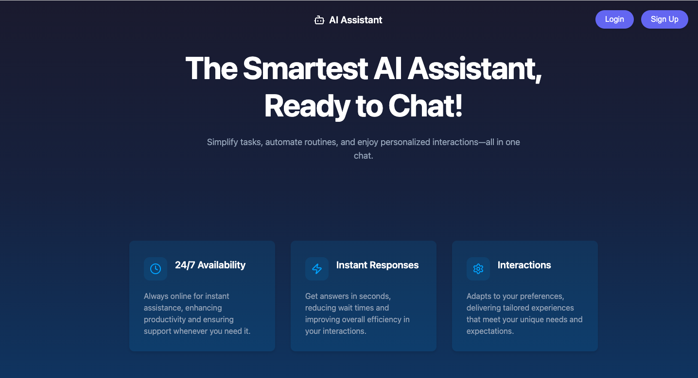
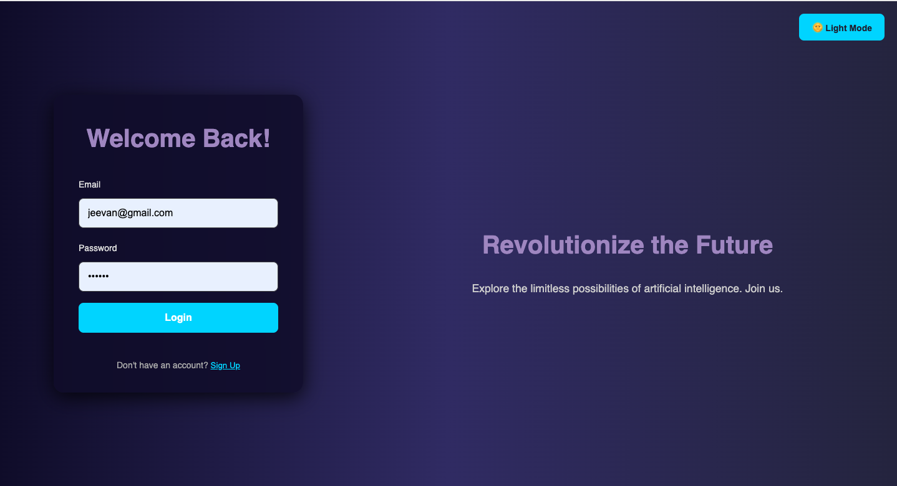
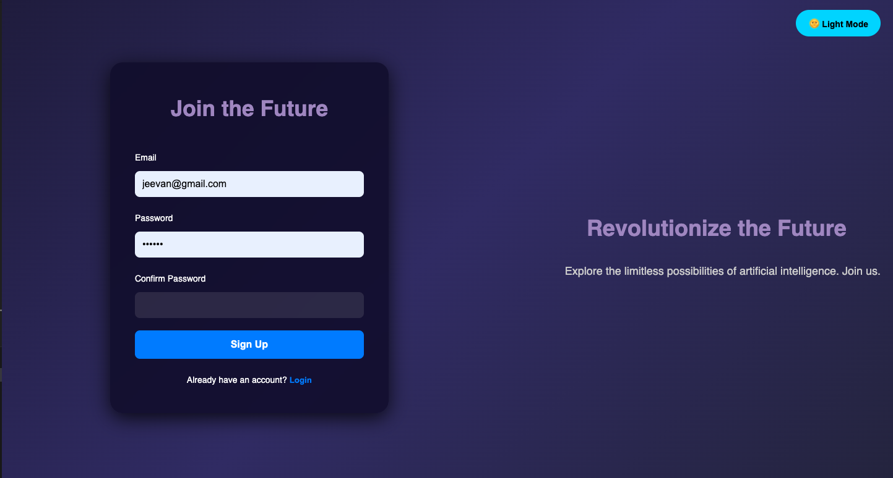
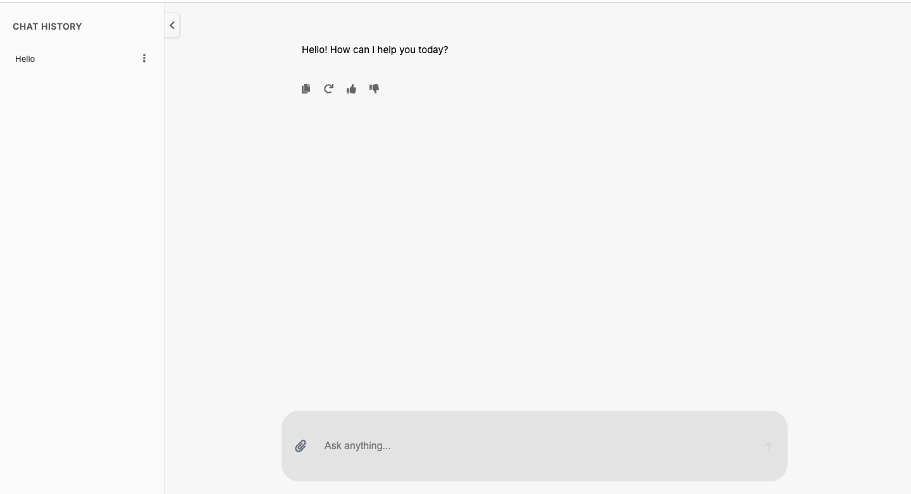

# Project Name: **[AI CHatbot]**

- **User Authentication**: Secure sign-up and login functionality.
- **Real-time Chat**: Users can send and receive messages in real-time.
- **Gemini API Integration**: Fetch cryptocurrency data using the Gemini API.
- **Frontend**: Built with React for a responsive and dynamic UI.
- **Backend**: Node.js and Express server managing requests and authentication.
- **Database**: MongoDB for user and chat message storage.
- **Axios**: Used for making API calls to retrieve live cryptocurrency data.
- **Deployment**: Designed for seamless deployment across devices.

---

## Table of Contents

- [Installation](#installation)
- [Dependencies](#dependencies)
- [Usage](#usage)
- [Screenshots](#screenshots)
- [License](#license)

---

## Installation

### 1. Clone the repository

To get started, first clone this repository to your local machine using Git:

```bash
git clone https://github.com/your-username/your-repo-name.git
```

### 2. Navigate to the project directory

```bash
cd your-repo-name
```

### 3. Install Dependencies

#### Backend:

In the root directory of the project, install the necessary backend dependencies. This includes libraries like Axios (for API requests), MongoDB (for database), and any other packages you may need.

```bash
npm install axios mongoose dotenv express cors
```

#### Frontend:

If your project has a frontend (e.g., React), go into the frontend directory and run:

```bash
cd client
npm install
```

#### Set up MongoDB

1. Install MongoDB on your local device or use MongoDB Atlas (cloud database).
   
   - [MongoDB Installation Guide](https://docs.mongodb.com/manual/installation/)

2. Create a `.env` file in your root directory to store sensitive credentials such as your MongoDB URI.

Example of `.env` file:

```plaintext
MONGO_URI=mongodb://localhost:27017/yourDatabase
PORT=5000
```

#### Install Axios

Axios is a promise-based HTTP client for making requests to external APIs.

Install it by running the following command:

```bash
npm install axios
```

#### Gemini API (if used in your project):

If you're integrating with the Gemini API, make sure you have registered for access and obtained your API keys. Add these to your `.env` file:

```plaintext
GEMINI_API_KEY=your-gemini-api-key
GEMINI_SECRET_KEY=your-gemini-secret-key
```

---

## Usage

### 1. Start the Backend Server

To start the backend server, use the following command:

```bash
npm start
```

This will start the server on the specified port (e.g., `http://localhost:5000`).

### 2. Start the Frontend Application

To start the frontend, navigate to the frontend directory and run:

```bash
npm start
```

This will start the React development server (e.g., `http://localhost:3000`).

### 3. Visit Your Application

Once both the backend and frontend are running, you can access the app in your browser by navigating to `http://localhost:3000`.

---

## Screenshots

### Homepage




### Login Page




### Signup Page



---

### Chat Page




---

## Troubleshooting

If you encounter any issues during installation or running the project, make sure:

- You have MongoDB installed or you're connected to MongoDB Atlas.
- Your `.env` file contains the correct credentials for MongoDB and Gemini API (if applicable).
- All dependencies are correctly installed by running `npm install`.

 ### Author 
 @Jeevan Shrestha

  ### Linkedin
 https://www.linkedin.com/in/jeevan-shrestha/


